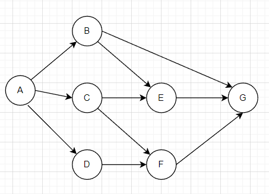
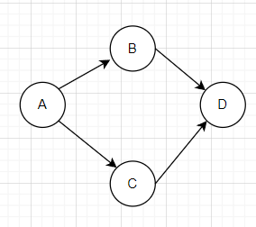

# dagrs

This project is a DAG execution engine written in Rust. For development documentation, please refer to: [Writing a DAG execution engine using Rust](https://openeuler.feishu.cn/docs/doccnVLprAY6vIMv6W1vgfLnfrf).

The DAG execution engine is a high-performance multi-task execution engine. It provides users with a convenient programming interface. Users can define tasks and specify dependencies, and the engine can help us execute all tasks in sequence.

The DAG execution engine allows you to define a sequence of tasks that may have dependencies between them. All tasks form a graph, such as:


This graph represents the dependencies between tasks, and the graph composed of tasks must satisfy two points:

- A graph allows only one point with zero in-degree and zero out-degree(Only one start task and one end task are allowed).

- The graph itself is directed, and the user must ensure that there are no loops in the graph, that is, the dependencies of tasks cannot form a closed loop, otherwise the engine will refuse to execute all tasks, for example:

  

Among them, each task may produce output, and may also require the output of some tasks as its input.

## Usage

Make sure the Rust compilation environment is available (`cargo build`), then run `cargo build --release` in this folder, fetch the executable in `target/release/` and put it in the PATH.

This project is aimed at two target groups.

- General users - define and schedule tasks by `yaml` files.
- Programmers - define and schedule tasks by  `TaskTrait`.

## Write a yaml configuration file to define the task flow

This part is catering for the general user who doesn't use rust, it use YAML files to define and schedule tasks. An example YAML file is as follows:

```yaml
dagrs:
  a:
    name: "Task1"
    after: [b]
    run:
      type: sh
      script: . /test/test.sh
  b:
    name: "Task2"
    run:
      type: deno
      script: print("Hello!")
```

- The YAML file should start with `dagrs`.

- `a,b` is identifiers for the tasks. This field must be defined and unique (otherwise it will overwrite the earlier definition).
- `name` is the name of the task, it will be output to log file at subsequent scheduling. This field must be defined and it can be the same as other task's name .
- `after` is the order of task execution. For example, `after: [b]` in task `a` means that `a` should be executed after `b`. Also, task `a` may require the output from task `b` as its input.
- `run` is the details of the task, including the subfields `type` and `script`. This field and its subfields must exist.
  - `type` is the execution type of the task, it supports shell (sh) and deno (deno) now.
  - `script` is the content of the task, which can be a program or a file.

Another example with input and output:

```yaml
dagrs:
  a:
    name: "Task1"
    after: [b]
    run:
      type: sh
      script: echo > . /test/test_value_pass1.txt
  b:
    name: "Task2"
    run:
      type: deno
      script: let a = 1+4; a*2
```

In the above example:
- Task `b` execute with the built-in `deno`, apparently it returns `10`
- Then `a` will be executed, and the input value will be spliced to the end of the `script` as a string, i.e. the following command is executed.
  `echo > . /test/test_value_pass1.txt 10`
- At the end of execution, a file `test/test_value_pass1.txt` will be created, and it will have a '10' in it.

**Notice:** The deno is output only now(due to some interface issues about `deno_core`.

### How does it work? 

After writing the yaml file, you can run it with cli:

```bash
$ ./target/release/dagrs --help
dagrs 0.2.0
Command Line input

USAGE:
    dagrs [OPTIONS] <FILE>

ARGS:
    <FILE> YAML file path

OPTIONS:
    -h, --help Print help information
    -l, --logpath <LOGPATH> Log file path
    -V, --version Print version information
```

For example, run with the YAML `test/test_value_pass1.yaml`:

```bash
$ ./target/debug/dagrs.exe ./test/test_value_pass2.yaml
07:51:33 [INFO] [Start] -> Task 1 -> Task 2 -> [End]
07:51:33 [INFO] Executing Task[name: Task 1]
07:51:33 [INFO] Executing Task[name: Task 2]
07:51:34 [INFO] Finish Task[name: Task 1]
07:51:34 [INFO] Finish Task[name: Task 2]
```

You can get the details of the program after you run it, and you can find the log file at `$HOME/.dagrs/dagrs.log` (this is the default address, you can define it with the `-l` option).

The log file records the program's execution sequence and result, for this example, it just like this:

```bash
$ cat ~/.dagrs/dagrs.log
07:51:33 [INFO] [Start] -> Task 1 -> Task 2 -> [End]
07:51:33 [INFO] Executing Task[name: Task 1]
07:51:33 [INFO] Executing Task[name: Task 2]
07:51:34 [INFO] Finish Task[name: Task 1]
07:51:34 [INFO] Finish Task[name: Task 2]
```


## Implement `TaskTrait` to define task flow

Rust Programmer can define their own tasks more flexibly by `TaskTrait`. The definition of `TaskTrait` is as follows:

```rust
pub trait TaskTrait {
    fn run(&self, input: Input, env: EnvVar) -> Output;
}
```

- `run` is the content of the task, it will be scheduled by dagrs.
- `input` is the input to the task, which is managed by `dagrs`.
- `env` is a global variable for the `dagrs`.
- `Ouput` is the return value of the task.

Your task struct needs to be placed in the `TaskWrapper` for use and set dependencies via the `exec_after` and `input_from`, as seen in the example below.

### Examples 

**A simple [example](. /examples/hello.rs) is as follows:**

```rust
extern crate dagrs;

use dagrs::{DagEngine, EnvVar, Input, Output, TaskTrait, TaskWrapper, init_logger};

struct T1 {}

impl TaskTrait for T1 {
    fn run(&self, _input: Input, _env: EnvVar) -> Output {
        let hello_dagrs = String::from("Hello Dagrs!");
        Output::new(hello_dagrs)
    }
}

struct T2 {}

impl TaskTrait for T2 {
    fn run(&self, mut input: Input, _env: EnvVar) -> Output {
        let val = input.get::<String>(0).unwrap();
        println!("{}", val);
        Output::empty()
    }
}

fn main() {
    // Use dagrs provided logger
    init_logger(None);

    let t1 = TaskWrapper::new(T1{}, "Task 1");
    let mut t2 = TaskWrapper::new(T2{}, "Task 2");
    let mut dagrs = DagEngine::new();

    // Set up dependencies
    t2.set_predecessors(&[&t1]);

    dagrs.add_tasks(vec![t1, t2]);
    assert!(dagrs.run().unwrap())
}
```

Execute the command  `cargo run`. The output is as follows.

```bash
$ cargo run
07:54:38 [INFO] [Start] -> Task 1 -> Task 2 -> [End]
07:54:38 [INFO] Executing Task[name: Task 1]
07:54:38 [INFO] Executing Task[name: Task 2]
07:54:38 [INFO] Finish Task[name: Task 1]
Hello Dagrs!
07:54:38 [INFO] Finish Task[name: Task 2]
```

Some explanations.

- `input` provides a `get` method to get the task's input values, which takes an `index` where the input values are stored.(`input` is not required, it may be empty, depending on whether the user-defined task produces output)
- `env` provides `get` and `set`, [example reference](. /examples/hello_env.rs).
  - `set` sets the environment variable, whose name must be a string.
  - `get` is to get the value of an environment variable.
- `Output` is the return value of the task, provides `new` and `empty` methods.


**There are two complex task flows under the example folder**:

- compute.rs：For the convenience of demonstration, we use macros to automatically generate tasks with the same behavior. This task is a simple accumulation.

  

- use_macro.rs：Generate simple tasks using the macro `generate_task` provided by `dagrs`.



**Notice:** The whole custom task should be `Sync` and `Send` for one reason: the task is put into a thread to perform scheduling.

### Run the script 

You can run the script through the `RunScript` struct (or, of course, directly in the code itself without going through the struct), defined as follows:

```rust
pub struct RunScript {
    script: String,
    executor: RunType,
}
```

Here:
- `script` is the script, either the command itself ("echo hello!"), also can be the path to the script (". /test/test.sh").
- `executor` is the way the task execute, and `RunType` is an enumerated type.
  
  ```rust
  pub enum RunType {
      SH,
      DENO,
  }

`RunScript` provides the `exec` function.

```rust
pub fn exec(&self, input: Input) -> Result<String, DagError> {}
```

It will returns the result as `String` if it executes correctly, otherwise returns a `DagError` error type.

**A simple [example](. /examples/hello_script.rs):**

```rust
extern crate dagrs;

use dagrs::{DagEngine, EnvVar, Input, Output, TaskTrait, TaskWrapper, init_logger, RunScript, RunType};

struct T {}

impl TaskTrait for T {
    fn run(&self, _input: Input, _env: EnvVar) -> Output {
        let script = RunScript::new("echo 'Hello Dagrs!'", RunType::SH);

        let res = script.exec(None);
        println!("{:?}" , res);
        Output::empty()
    }
}

fn main() {
    // Use dagrs provided logger
    init_logger(None);

    let t = TaskWrapper::new(T{}, "Task");
    let mut dagrs = DagEngine::new();

    dagrs.add_tasks(vec![t]);
    assert!(dagrs.run().unwrap())
}
```

The result is:

```bash
08:22:09 [INFO] [Start] -> Task -> [End]
08:22:09 [INFO] Executing Task[name: Task]
Ok("Hello Dagrs!\n")
08:22:09 [INFO] Finish Task[name: Task]
```

## Contribution

Thank you for considering contributing to `dagrs`! This project enforces the [DCO](https://developercertificate.org). Contributors sign-off that they adhere to these requirements by adding a Signed-off-by line to commit messages. Git even has a -s command line option to append this automatically to your commit message:

```bash
$ git commit -s -m 'This is my commit message'
$ git status
This is my commit message
Signed-off-by: Random J Developer <random@developer.example.org>
```

## License

Freighter is licensed under this Licensed:

* MIT LICENSE ([LICENSE-MIT](LICENSE-MIT) or https://opensource.org/licenses/MIT)
* Apache License, Version 2.0 ([LICENSE-APACHE](LICENSE-APACHE) or https://www.apache.org/licenses/LICENSE-2.0)

## Acknowledgements
