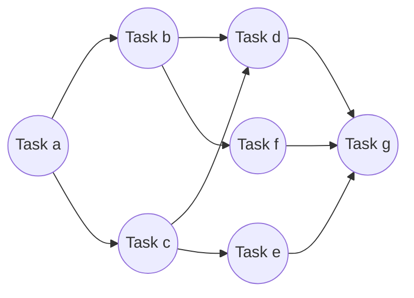

# Dagrs

`dagrs` are suitable for the execution of multiple tasks with graph-like dependencies. `dagrs` has the characteristics of high performance and asynchronous execution. It provides users with a convenient programming interface.

The development of `dagrs` follows the concept of Flow-based Programming.

## Flow-based Programming

Flow-based Programming (FBP) was invented by J. Paul Morrison in the early 1970s. It was initially implemented in software for a Canadian bank. Over the years, it’s had various names but has always maintained its core principles of reducing development time and managing processes efficiently.

FBP treats applications as networks of 'black box' processes that communicate by sending and receiving data, referred to as Information Packets, over predefined connections. It’s a component-oriented approach that fits well with modular software architecture.

FBP features 

- Encapsulated processes and information packets.
- The external definition of connections
- Asynchronous
- Information packets with unique ownership and defined lifetimes
- Bounded connections with a finite capacity and reserve pressure.

## What can `dagrs` do

`dagrs` allows users to easily execute multiple sets of tasks with complex graph dependencies. It only requires:
The user defines tasks and specifies the dependencies of the tasks, and `dagrs` can execute the tasks sequentially in the topological sequence of the graph.
For example:



This graph represents the dependencies between tasks, and the graph composed of tasks must satisfy two points:

- A graph allows only one point with zero in-degree and zero out-degree(Only one start task and one end task are allowed).

- The graph itself is directed, and the user must ensure that there are no loops in the graph, that is, the dependencies of tasks cannot form a closed loop, otherwise the engine will refuse to execute all tasks, for example:

  ```mermaid
  flowchart LR
  	A-->C
  	A((Task a))-->B
  	subgraph "Task b, c, and d form a loop"
  	B((Task b))-->C
  	C((Task c))-->D
  	D((Task d))-->B
  	end
  ```

Among them, each task may produce output, and may also require the output of some tasks as its input.


## Contribution

The `dagrs` project relies on community contributions and aims to simplify getting started. To develop `dagrs`, clone the repository, then install all dependencies, run the test suite and try it out locally. Pick an issue, make changes, and submit a pull request for community review.

### What's the contribution

Here are some guidelines for contributing to this project:

1. Report issues/bugs: If you find any issues or bugs in the project, please report them by creating an issue on the issue tracker. Describe the issue in detail and also mention the steps to reproduce it. The more details you provide, the easier it will be for me to investigate and fix the issue.
2. Suggest enhancements: If you have an idea to enhance or improve this project, you can suggest it by creating an issue on the issue tracker. Explain your enhancement in detail along with its use cases and benefits. I appreciate well-thought-out enhancement suggestions.
3. Contribute code: If you want to develop and contribute code, follow these steps:
   - Choose an issue to work on. Issues labeled `good first issue` are suitable for newcomers. You can also look for issues marked `help wanted`.
   - Fork the `dagrs` repository and create a branch for your changes.
   - Make your changes and commit them with a clear commit message. Sign the [Developer Certificate of Origin](https://developercertificate.org/) (DCO) by adding a `Signed-off-by` line to your commit messages. This certifies that you wrote or have the right to submit the code you are contributing to the project.
   - Push your changes to GitHub and open a pull request.
   - Respond to any feedback on your pull request. The `dagrs` maintainers will review your changes and may request modifications before merging. Please ensure your code is properly formatted and follows the same style as the existing codebase.
   - Once your pull request is merged, you will be listed as a contributor in the project repository and documentation.
4. Write tutorials/blog posts: You can contribute by writing tutorials or blog posts to help users get started with this project. Submit your posts on the issue tracker for review and inclusion. High quality posts that provide value to users are highly appreciated.
5. Improve documentation: If you find any gaps in the documentation or think any part can be improved, you can make changes to files in the documentation folder and submit a PR. Ensure the documentation is up-to-date with the latest changes.

Your contributions are highly appreciated. Feel free to ask any questions if you have any doubts or facing issues while contributing. The more you contribute, the more you will learn and improve your skills.

### DCO & PGP

To comply with the requirements, contributors must include both a `Signed-off-by` line and a PGP signature in their commit messages. You can find more information about how to generate a PGP key [here](https://docs.github.com/en/github/authenticating-to-github/managing-commit-signature-verification/generating-a-new-gpg-key).

Git even has a `-s` command line option to append this automatically to your commit message, and `-S` to sign your commit with your PGP key. For example:

```bash
$ git commit -S -s -m 'This is my commit message'
```

### Rebase the branch

If you have a local git environment and meet the criteria below, one option is to rebase the branch and add your Signed-off-by lines in the new commits. Please note that if others have already begun work based upon the commits in this branch, this solution will rewrite history and may cause serious issues for collaborators (described in the git documentation under “The Perils of Rebasing”).

You should only do this if:

- You are the only author of the commits in this branch
- You are absolutely certain nobody else is doing any work based upon this branch
- There are no empty commits in the branch (for example, a DCO Remediation Commit which was added using `-allow-empty`)

To add your Signed-off-by line to every commit in this branch:

- Ensure you have a local copy of your branch by checking out the pull request locally via command line.
- In your local branch, run: `git rebase HEAD~1 --signoff`
- Force push your changes to overwrite the branch: `git push --force-with-lease origin main`

## License

Freighter is licensed under this Licensed:

* MIT LICENSE ([LICENSE-MIT](LICENSE-MIT) or https://opensource.org/licenses/MIT)
* Apache License, Version 2.0 ([LICENSE-APACHE](LICENSE-APACHE) or https://www.apache.org/licenses/LICENSE-2.0)

## Contact us

QIUZHILEI email: 2925212608@qq.com/QZL2503687@gmail.com

### Discord

Welcome to join our discord channel https://discord.gg/xaHZXwnn 

