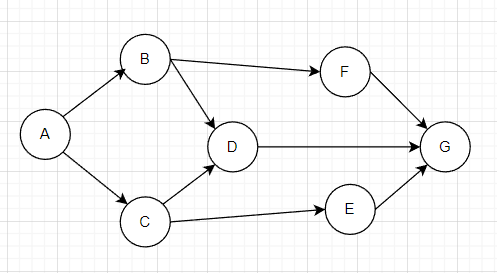
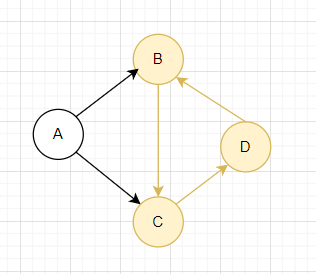
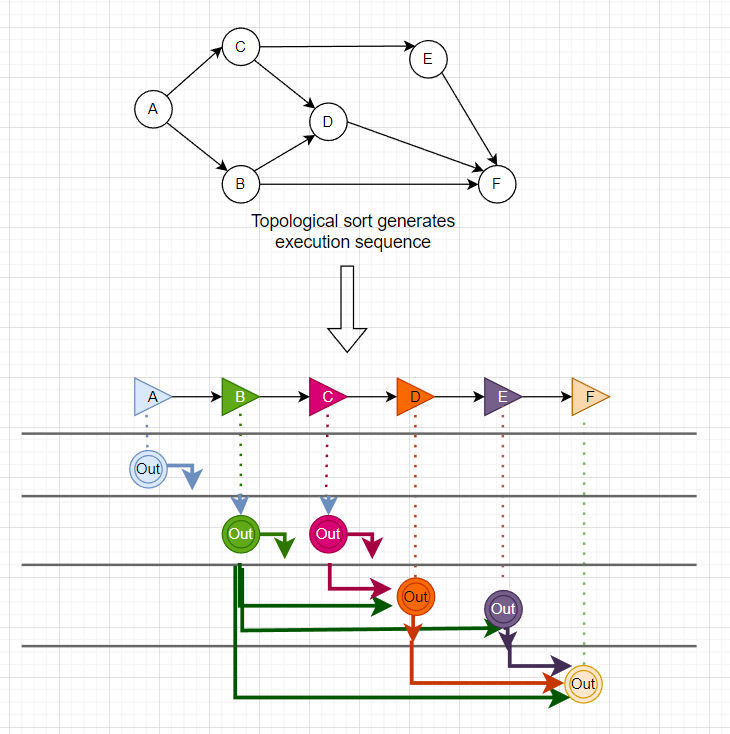

# dagrs

## What is dagrs

dagrs are suitable for the execution of multiple tasks with graph-like dependencies. dagrs has the characteristics of high performance and asynchronous execution. It provides users with a convenient programming interface.

## What can dagrs do

dagrs allows users to easily execute multiple sets of tasks with complex graph dependencies. It only requires:
The user defines tasks and specifies the dependencies of the tasks, and dagrs can execute the tasks sequentially in the topological sequence of the graph.
For example:



This graph represents the dependencies between tasks, and the graph composed of tasks must satisfy two points:

- A graph allows only one point with zero in-degree and zero out-degree(Only one start task and one end task are allowed).

- The graph itself is directed, and the user must ensure that there are no loops in the graph, that is, the dependencies of tasks cannot form a closed loop, otherwise the engine will refuse to execute all tasks, for example:

  

Among them, each task may produce output, and may also require the output of some tasks as its input.

## The way to use dagrs

dagrs provides users with two basic task execution methods:

1. The first one: the user does not need to program, but only needs to provide the task configuration file in yaml format. A standard yaml configuration file format is given below:

   ```yaml
   dagrs:
     a:
       name: "Task 1"
       after: [ b, c ]
       run:
         type: sh
         script: echo a
     b:
       name: "Task 2"
       after: [ c, f, g ]
       run:
         type: sh
         script: echo b
     c:
       name: "Task 3"
       after: [ e, g ]
       run:
         type: sh
         script: echo c
     d:
       name: "Task 4"
       after: [ c, e ]
       run:
         type: sh
         script: echo d
     e:
       name: "Task 5"
       after: [ h ]
       run:
         type: sh
         script: echo e
     f:
       name: "Task 6"
       after: [ g ]
       run:
         type: deno
         script: Deno.core.print("f\n")
     g:
       name: "Task 7"
       after: [ h ]
       run:
         type: deno
         script: Deno.core.print("g\n")
     h:
       name: "Task 8"
       run:
         type: sh
         script: tests/config/sh_script.sh
   ```

   These yaml-defined task items form a complex dependency graph. In the yaml configuration file:

   - The file starts with `dagrs`
   - Similar to `a`, `b`, `c`... is the unique identifier of the task
   - `name` is a required attribute, which is the name of the task
   - `after` is an optional attribute (only the first executed task does not have this attribute), which represents which tasks are executed after the task, that is, specifies dependencies for tasks
   - `run` is a required attribute, followed by `type` and `script`, they are all required attributes, where `type` represents the type of task. Two types of tasks are currently supported: one is sh script and the other is JavaScript script. `script` represents the command to be executed

   To execute the yaml configured file, you need to compile this project, requiring rust version >= 1.70:

   ```bash
   $cargo build --release
   $./target/release/dagrs --yaml=./tests/config/correct.yaml --log-path=./dagrs.log --log-level=info
   ```

   You can see an example: `examples/yaml_dag.rs`

2. The second way is to programmatically implement the Action interface to rewrite the run function and construct a series of `DefaultTasks`. The example: `examples/compute_dag.rs`. `DefaultTask` is the default implementation of the Task trait, and it has several mandatory attributes:

   - `id`: uniquely identifies the task assigned by the global ID assigner
   - `name`: the name of the task
   - `predecessor_tasks`: the predecessor tasks of this task
   - `action`: is a dynamic type that implements the Action trait in user programming, and it is the specific logic to be executed by the task

**In addition to these two methods, dagrs also supports advanced task custom configuration.**

- `DefaultTask` is a default implementation of the `Task` trait. Users can also customize tasks and add more functions and attributes to tasks, but they still need to have the four necessary attributes in `DefaultTask`. `YamlTask` is another example of `Task` concrete implementation, its source code is available for reference, or refer to `example/custom_task.rs`.
- In addition to yaml-type configuration files, users can also provide other types of configuration files, but in order to allow other types of configuration files to be parsed as tasks, users need to implement the `Parser` trait. `YamlParser` source code is available for reference, or refer to `examples/custom_parser.rs`

## Try it out

Make sure the Rust compilation environment is available .

### Programmatically implement task definition

The way to use the yaml configuration file has been given above. Here we mainly discuss the way of programming to implement Action traits and provide Task.

```rust
use std::sync::Arc;
use dagrs::{
    Action,
    Dag, DefaultTask, EnvVar,log, Input, Output, RunningError,LogLevel
};

struct SimpleAction(usize);
/// Implement the `Action` trait for `SimpleAction`, defining the logic of the `run` function. 
/// The logic here is simply to get the output value (usize) of all predecessor tasks and then accumulate.
impl Action for SimpleAction{
    fn run(&self, input: Input,env:Arc<EnvVar>) -> Result<Output,RunningError> {
        let base = env.get::<usize>("base").unwrap();
        let mut sum = self.0;
        input
            .get_iter()
            .for_each(|i| sum += i.get::<usize>().unwrap() * base);
        Ok(Output::new(sum))
    }
}

// Initialize the global logger
log::init_logger(LogLevel::Info,None);
// Generate four tasks.
let a= DefaultTask::new(SimpleAction(10),"Task a");
let mut b=DefaultTask::new(SimpleAction(20),"Task b");
let mut c=DefaultTask::new(SimpleAction(30),"Task c");
let mut d=DefaultTask::new(SimpleAction(40),"Task d");
// Set the precursor for each task.
b.set_predecessors(&[&a]);
c.set_predecessors(&[&a]);
d.set_predecessors(&[&b,&c]);
// Take these four tasks as a Dag.
let mut dag=Dag::with_tasks(vec![a,b,c,d]);
// Set a global environment variable for this dag.
let mut env = EnvVar::new();
env.set("base", 2usize);
dag.set_env(env);
// Begin execution.
assert!(dag.start().unwrap());
// Get execution result
assert_eq!(dag.get_result::<usize>().unwrap(),220);
```

**explain:**

First, we define `SimpleAction` and implement the `Action` trait for this structure. In the rewritten run function, we simply get the output value of the predecessor task and multiply it by the environment variable `base`. Then accumulate the multiplied result to itself self.0.

After defining the specific task logic, start creating the prerequisites for executing `Dag`:
Initialize the global logger first. Here we set the log level to Info, and do not give the log output file, let the log output to the console by default.

Create a `DefaultTask` with `SimpleAction` and give the task a name. Then set the dependencies between tasks.

Then create a Dag and assign it a global environment variable.

Finally we call the `start` function of `Dag` to execute all tasks. After the task is executed, call the `get_result` function to obtain the final execution result of the task.

The graph formed by the task is shown below:

```
    B
  ↗   ↘
 A     D
  ↘   ↗
    C
```

The execution order is a->c->b->d. 

```bash
$cargo run
[Start] -> Task a -> Task c -> Task b -> Task d -> [End]
Executing Task[name: Task a]
Task executed successfully. [name: Task a]
Executing Task[name: Task b]
Executing Task[name: Task c]
Task executed successfully. [name: Task b]
Task executed successfully. [name: Task c]
Executing Task[name: Task d]
Task executed successfully. [name: Task d]

Process finished with exit code 0
```

### Use the dagrs command

First use the `cargo build --release` command to compile the project, requiring rust version >=1.70.

```bash
$ .\target\release\dagrs.exe --help
Usage: dagrs.exe [OPTIONS] --yaml <YAML>

Options:
      --log-path <LOG_PATH>    Log output file, the default is to print to the terminal
      --yaml <YAML>            yaml configuration file path
      --log-level <LOG_LEVEL>  Log level, the default is Info
  -h, --help                   Print help
  -V, --version                Print version
```

**parameter explanation:**

- The parameter yaml represents the path of the yaml configuration file and is a required parameter.
- The parameter log-path represents the path of the log output file and is an optional parameter. If not specified, the log is printed on the console by default.
- The parameter log-level represents the log output level, which is an optional parameter and defaults to info.

We can try an already defined file at `tests/config/correct.yaml`

```bash
$.\target\release\dagrs.exe --yaml=./tests/config/correct.yaml
[Start] -> Task 8 -> Task 5 -> Task 7 -> Task 6 -> Task 3 -> Task 2 -> Task 1 -> Task 4 -> [End]
Executing Task[name: Task 8]
Executing Task[name: Task 5]
Executing Task[name: Task 7]
g
Executing Task[name: Task 6]
f
Executing Task[name: Task 3]
Executing Task[name: Task 2]
Executing Task[name: Task 4]
Executing Task[name: Task 1]
```

## Analyze the logic of task execution

**The execution process of Dag is roughly as follows:**

- The user gives a list of tasks `tasks`. These tasks can be parsed from configuration files, or provided by user programming implementations.
- Internally generate`Graph`based on task dependencies, and generate execution sequences based on* `rely_graph`.
- The task is scheduled to start executing asynchronously.
- The task will wait to get the result`execute_states`generated by the execution of the predecessor task.
- If the result of the predecessor task can be obtained, check the continuation status`can_continue`, if it is true, continue to execute the defined logic, if it is false, trigger`handle_error`, and cancel the execution of the subsequent task.
- After all tasks are executed, set the continuation status to false, which means that the tasks of the dag cannot be scheduled for execution again.



## The examples

### Basic function usage

`examples/compute_dag.rs`: Use a custom macro to generate multiple simple tasks.

`examples/impl_action.rs`: Define a simple Action to build multiple tasks with the same logic.

`examples/yaml_dag.rs`: Spawn multiple tasks with a given yaml configuration file。

`examples/use_macro.rs`: Use the `gen_task` macro provided by dagrs to generate multiple simple tasks。

`examples/engine.rs`:  Using `Engine` to manage multiple dags with different task types.

### Advanced Features

`examples/custom_task.rs`:  Implement the `Task` trait and define your own task type.

`examples/custom_parser.rs`:  Implement the `Parser` trait to define your own task configuration file parser。

`examples/custom_log.rs`:  Implement the `Logger` trait to define your own global logger.

## Contribution

Thank you for considering contributing to `dagrs`! This project enforces the [DCO](https://developercertificate.org). Contributors sign-off that they adhere to these requirements by adding a Signed-off-by line to commit messages. Git even has a -s command line option to append this automatically to your commit message:

```bash
$ git commit -s -m 'This is my commit message'
$ git status
This is my commit message
Signed-off-by: Random J Developer <random@developer.example.org>
```

## License

Freighter is licensed under this Licensed:

* MIT LICENSE ([LICENSE-MIT](LICENSE-MIT) or https://opensource.org/licenses/MIT)
* Apache License, Version 2.0 ([LICENSE-APACHE](LICENSE-APACHE) or https://www.apache.org/licenses/LICENSE-2.0)
