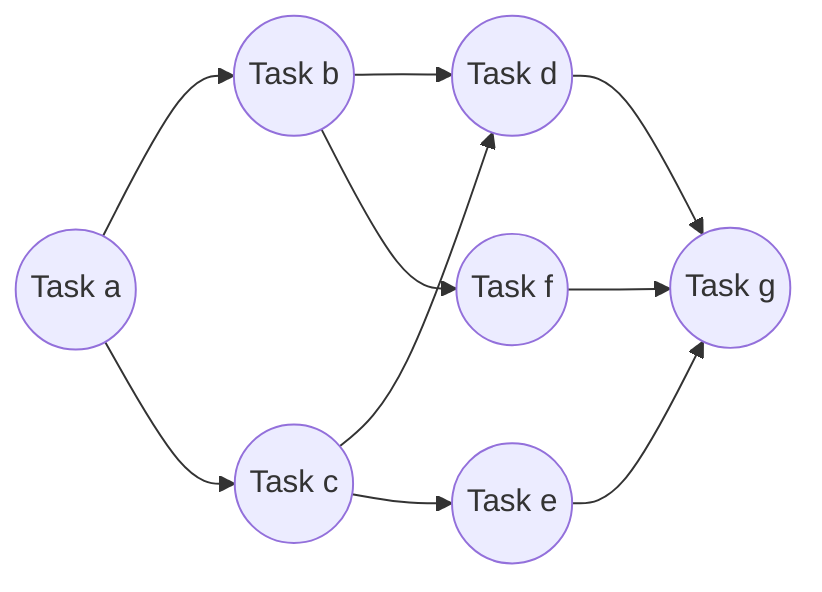
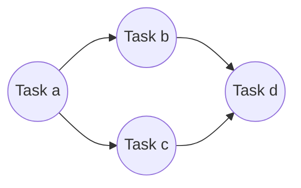

# Dagrs

`dagrs` are suitable for the execution of multiple tasks with graph-like dependencies. `dagrs` has the characteristics of high performance and asynchronous execution. It provides users with a convenient programming interface.

## What can `dagrs` do

`dagrs` allows users to easily execute multiple sets of tasks with complex graph dependencies. It only requires:
The user defines tasks and specifies the dependencies of the tasks, and `dagrs` can execute the tasks sequentially in the topological sequence of the graph.
For example:



This graph represents the dependencies between tasks, and the graph composed of tasks must satisfy two points:

- A graph allows only one point with zero in-degree and zero out-degree(Only one start task and one end task are allowed).

- The graph itself is directed, and the user must ensure that there are no loops in the graph, that is, the dependencies of tasks cannot form a closed loop, otherwise the engine will refuse to execute all tasks, for example:

  ```mermaid
  flowchart LR
  	A-->C
  	A((Task 1))-->B
  	subgraph "Task B, C, and D form a loop"
  	B((Task 2))-->C
  	C((Task 3))-->D
  	D((Task 4))-->B
  	end
  ```

Among them, each task may produce output, and may also require the output of some tasks as its input.

## Try using `dagrs`

`dagrs` provides two basic task definition methods, which are programming to implement the logic of the task and defining the yaml configuration file. Programmatically implementing the definition of tasks will make the logic of tasks more flexible, and it is also the main method of using `dagrs`. Next, we will introduce the usage of the two methods in detail.

*Make sure the Rust compilation environment is available.*

### Programmatically implement task definition

Users need to program to implement the `Action` trait to define the specific logic of the task, and then build a series of `DefaultTask`. The example: `examples/compute_dag.rs`. `DefaultTask` is the default implementation of the Task trait, and it has several mandatory attributes:

- `id`: uniquely identifies the task assigned by the global ID assigner
- `name`: the name of the task
- `predecessor_tasks`: the predecessor tasks of this task
- `action`: is a dynamic type that implements the Action trait in user programming, and it is the specific logic to be executed by the task

```rust
use std::sync::Arc;
use dagrs::{
    Action,
    Dag, DefaultTask, EnvVar,log, Input, Output, RunningError,LogLevel
};

struct SimpleAction(usize);
/// Implement the `Action` trait for `SimpleAction`, defining the logic of the `run` function. 
/// The logic here is simply to get the output value (`usize`) of all predecessor tasks and then accumulate.
impl Action for SimpleAction{
    fn run(&self, input: Input,env:Arc<EnvVar>) -> Result<Output,RunningError> {
        let base = env.get::<usize>("base").unwrap();
        let mut sum = self.0;
        input
            .get_iter()
            .for_each(|i| sum += i.get::<usize>().unwrap() * base);
        Ok(Output::new(sum))
    }
}

// Initialize the global logger
log::init_logger(LogLevel::Info,None);
// Generate four tasks.
let a= DefaultTask::new(SimpleAction(10),"Task a");
let mut b=DefaultTask::new(SimpleAction(20),"Task b");
let mut c=DefaultTask::new(SimpleAction(30),"Task c");
let mut d=DefaultTask::new(SimpleAction(40),"Task d");
// Set the precursor for each task.
b.set_predecessors(&[&a]);
c.set_predecessors(&[&a]);
d.set_predecessors(&[&b,&c]);
// Take these four tasks as a Dag.
let mut dag=Dag::with_tasks(vec![a,b,c,d]);
// Set a global environment variable for this dag.
let mut env = EnvVar::new();
env.set("base", 2usize);
dag.set_env(env);
// Begin execution.
assert!(dag.start().unwrap());
// Get execution result
assert_eq!(dag.get_result::<usize>().unwrap(),220);
```

**explain:**

First, we define `SimpleAction` and implement the `Action` trait for this structure. In the rewritten run function, we simply get the output value of the predecessor task and multiply it by the environment variable `base`. Then accumulate the multiplied result to itself self.0.

After defining the specific task logic, start creating the prerequisites for executing `Dag`:
Initialize the global logger first. Here we set the log level to Info, and do not give the log output file, let the log output to the console by default.

Create a `DefaultTask` with `SimpleAction` and give the task a name. Then set the dependencies between tasks.

Then create a Dag and assign it a global environment variable.

Finally we call the `start` function of `Dag` to execute all tasks. After the task is executed, call the `get_result` function to obtain the final execution result of the task.

The graph formed by the task is shown below:



The execution order is a->c->b->d. 

```bash
$cargo run
[Start] -> Task a -> Task c -> Task b -> Task d -> [End]
Executing Task[name: Task a]
Task executed successfully. [name: Task a]
Executing Task[name: Task b]
Executing Task[name: Task c]
Task executed successfully. [name: Task b]
Task executed successfully. [name: Task c]
Executing Task[name: Task d]
Task executed successfully. [name: Task d]

Process finished with exit code 0
```

### `Yaml` configuration file

A standard yaml configuration file format is given below:

```yaml
dagrs:
  a:
    name: "Task 1"
    after: [ b, c ]
    cmd: echo a
  b:
    name: "Task 2"
    after: [ c, f, g ]
    cmd: echo b
  c:
    name: "Task 3"
    after: [ e, g ]
    cmd: echo c
  d:
    name: "Task 4"
    after: [ c, e ]
    cmd: echo d
  e:
    name: "Task 5"
    after: [ h ]
    cmd: echo e
  f:
    name: "Task 6"
    after: [ g ]
    cmd: python3 ./tests/config/test.py
  g:
    name: "Task 7"
    after: [ h ]
    cmd: deno run ./tests/config/test.js
  h:
    name: "Task 8"
    cmd: echo h
```

These yaml-defined task items form a complex dependency graph. In the yaml configuration file:

- The file starts with `dagrs`
- Similar to `a`, `b`, `c`... is the unique identifier of the task
- `name` is a required attribute, which is the name of the task
- `after` is an optional attribute (only the first executed task does not have this attribute), which represents which tasks are executed after the task, that is, specifies dependencies for tasks
- `cmd` is a optional attribute. You need to point out the command to be executed, such as the basic shell command: `echo hello`, execute the python script `python test.py`, etc. The user must ensure that the interpreter that executes the script exists in the environment variable. `CommandAction` is the implementation of the specific execution logic of the script, which is put into a specific `Task` type.
  If users want to customize other types of script tasks, or implement their own script execution logic, they can implement the "Action" feature through programming, and when parsing the configuration file, provide the parser with a specific type that implements the `Action` feature, and the method should be in the form of a key-value pair: <id,action>. Although this is more troublesome, this method will be more flexible.

To parse the yaml configured file, you need to compile this project, requiring rust version >= 1.70:

```bash
$cargo build --release
$ .\target\release\dagrs.exe --help
Usage: dagrs.exe [OPTIONS] --yaml <YAML>

Options:
      --log-path <LOG_PATH>    Log output file, the default is to print to the terminal
      --yaml <YAML>            yaml configuration file path
      --log-level <LOG_LEVEL>  Log level, the default is Info
  -h, --help                   Print help
  -V, --version                Print version
```

**parameter explanation:**

- The parameter yaml represents the path of the yaml configuration file and is a required parameter.
- The parameter log-path represents the path of the log output file and is an optional parameter. If not specified, the log is printed on the console by default.
- The parameter log-level represents the log output level, which is an optional parameter and defaults to info.

We can try an already defined file at `tests/config/correct.yaml`

```bash
$./target/release/dagrs --yaml=./tests/config/correct.yaml --log-path=./dagrs.log --log-level=info
[Start] -> Task 8 -> Task 5 -> Task 7 -> Task 6 -> Task 3 -> Task 2 -> Task 1 -> Task 4 -> [End]
Executing Task[name: Task 8]
Executing Task[name: Task 5]
Executing Task[name: Task 7]
Executing Task[name: Task 6]
Executing Task[name: Task 3]
Executing Task[name: Task 2]
Executing Task[name: Task 4]
Executing Task[name: Task 1]
```

You can see an example: `examples/yaml_dag.rs`.  In fact, you can also programmatically read the yaml configuration file generation task, which is very simple, just use the `with_yaml` function provided by `Dag` to parse the configuration file.

**In addition to these two methods, `dagrs` also supports advanced task custom configuration.**

- `DefaultTask` is a default implementation of the `Task` trait. Users can also customize tasks and add more functions and attributes to tasks, but they still need to have the four necessary attributes in `DefaultTask`. `YamlTask` is another example of `Task` concrete implementation, its source code is available for reference, or refer to `example/custom_task.rs`.
- In addition to yaml-type configuration files, users can also provide other types of configuration files, but in order to allow other types of configuration files to be parsed as tasks, users need to implement the `Parser` trait. `YamlParser` source code is available for reference, or refer to `examples/custom_parser.rs`

## Analyze the logic of task execution

**The execution process of Dag is roughly as follows:**

- The user gives a list of tasks `tasks`. These tasks can be parsed from configuration files, or provided by user programming implementations.

- Internally generate `Graph` based on task dependencies, and generate execution sequences based on* `rely_graph`.

  ```mermaid
  flowchart TD
  	subgraph tasks
  	direction LR
          A-->B
          A-->C
          B-->D
          B-->F
          C-->D
          C-->E
          D-->F
          E-->F
  	end
  	subgraph seq
  	direction LR
  		a(A)-->b(B)-->c(C)-->d(D)-->e(E)-->f(F)
  	end
  	tasks==Generate execution sequence based on topological sort==>seq
  ```

  

- The task is scheduled to start executing asynchronously.

- The task will wait to get the result`execute_states`generated by the execution of the predecessor task.

  ```mermaid
  ---
  title: data flow
  ---
  flowchart LR
  	A-->oa((out))
  	oa--input-->B
  	oa--input-->C
  	B-->ob((out))
  	ob--input-->D
  	ob--input-->F
  	C-->oc((out))
  	oc--input-->D
  	oc--input-->E
  	D-->od((out))
  	od--input-->F
  	E-->oe((out))
  	oe--input-->F
  	F-->of((out))
  ```

  

- If the result of the predecessor task can be obtained, check the continuation status`can_continue`, if it is true, continue to execute the defined logic, if it is false, trigger`handle_error`, and cancel the execution of the subsequent task.

- After all tasks are executed, set the continuation status to false, which means that the tasks of the `dag` cannot be scheduled for execution again. 

The task execution mode of `dagrs` is parallel. In the figure, the execution sequence is divided into four intervals by the vertical dividing line. During the overall execution of the task, it will go through four parallel execution stages. As shown in the figure: first task A is executed, and tasks B and C obtain the output of A as the input of their own tasks and start to execute in parallel; similarly, tasks D and E must wait until they obtain the output of their predecessors before starting to execute in parallel; finally, Task F must wait for the execution of tasks B, D, and E to complete before it can start executing.

```mermaid
gantt
	dateFormat X
    axisFormat %s
    title Execution timing
	section Step1
		Task A:0,10
		Task B:0,1
		Task C:0,1
		Task D:0,1
		Task E:0,1
		Task F:0,1
	section Step2
		Task B:10,19
		Task C:10,19
	section Step3
		Task D:19,28
		Task E:19,28
	section Step4
		Task F:28,37
```




## The examples

### Basic function usage

`examples/compute_dag.rs`: Use a custom macro to generate multiple simple tasks.

`examples/impl_action.rs`: Define a simple Action to build multiple tasks with the same logic.

`examples/yaml_dag.rs`: Spawn multiple tasks with a given yaml configuration file。

`examples/use_macro.rs`: Use the `gen_task` macro provided by `dagrs` to generate multiple simple tasks。

`examples/engine.rs`:  Using `Engine` to manage multiple dags with different task types.

### Advanced Features

`examples/custom_task.rs`:  Implement the `Task` trait and define your own task type.

`examples/custom_parser.rs`:  Implement the `Parser` trait to define your own task configuration file parser。

`examples/custom_log.rs`:  Implement the `Logger` trait to define your own global logger.

## Contribution

The dagrs project relies on community contributions and aims to simplify getting started. To develop `dagrs`, clone the repository, then install all dependencies, run the test suite and try it out locally. Pick an issue, make changes, and submit a pull request for community review.

### What's the contribution

Here are some guidelines for contributing to this project:

1. Report issues/bugs: If you find any issues or bugs in the project, please report them by creating an issue on the issue tracker. Describe the issue in detail and also mention the steps to reproduce it. The more details you provide, the easier it will be for me to investigate and fix the issue.
2. Suggest enhancements: If you have an idea to enhance or improve this project, you can suggest it by creating an issue on the issue tracker. Explain your enhancement in detail along with its use cases and benefits. I appreciate well-thought-out enhancement suggestions.
3. Contribute code: If you want to develop and contribute code, follow these steps:
   - Choose an issue to work on. Issues labeled `good first issue` are suitable for newcomers. You can also look for issues marked `help wanted`.
   - Fork the `dagrs` repository and create a branch for your changes.
   - Make your changes and commit them with a clear commit message. Sign the [Developer Certificate of Origin](https://developercertificate.org/) (DCO) by adding a `Signed-off-by` line to your commit messages. This certifies that you wrote or have the right to submit the code you are contributing to the project.
   - Push your changes to GitHub and open a pull request.
   - Respond to any feedback on your pull request. The `dagrs` maintainers will review your changes and may request modifications before merging. Please ensure your code is properly formatted and follows the same style as the existing codebase.
   - Once your pull request is merged, you will be listed as a contributor in the project repository and documentation.
4. Write tutorials/blog posts: You can contribute by writing tutorials or blog posts to help users get started with this project. Submit your posts on the issue tracker for review and inclusion. High quality posts that provide value to users are highly appreciated.
5. Improve documentation: If you find any gaps in the documentation or think any part can be improved, you can make changes to files in the documentation folder and submit a PR. Ensure the documentation is up-to-date with the latest changes.

Your contributions are highly appreciated. Feel free to ask any questions if you have any doubts or facing issues while contributing. The more you contribute, the more you will learn and improve your skills.

### DCO & PGP

To comply with the requirements, contributors must include both a `Signed-off-by` line and a PGP signature in their commit messages. You can find more information about how to generate a PGP key [here](https://docs.github.com/en/github/authenticating-to-github/managing-commit-signature-verification/generating-a-new-gpg-key).

Git even has a `-s` command line option to append this automatically to your commit message, and `-S` to sign your commit with your PGP key. For example:

```bash
$ git commit -S -s -m 'This is my commit message'
```

### Rebase the branch

If you have a local git environment and meet the criteria below, one option is to rebase the branch and add your Signed-off-by lines in the new commits. Please note that if others have already begun work based upon the commits in this branch, this solution will rewrite history and may cause serious issues for collaborators (described in the git documentation under “The Perils of Rebasing”).

You should only do this if:

- You are the only author of the commits in this branch
- You are absolutely certain nobody else is doing any work based upon this branch
- There are no empty commits in the branch (for example, a DCO Remediation Commit which was added using `-allow-empty`)

To add your Signed-off-by line to every commit in this branch:

- Ensure you have a local copy of your branch by checking out the pull request locally via command line.
- In your local branch, run: `git rebase HEAD~1 --signoff`
- Force push your changes to overwrite the branch: `git push --force-with-lease origin main`

## License

Freighter is licensed under this Licensed:

* MIT LICENSE ([LICENSE-MIT](LICENSE-MIT) or https://opensource.org/licenses/MIT)
* Apache License, Version 2.0 ([LICENSE-APACHE](LICENSE-APACHE) or https://www.apache.org/licenses/LICENSE-2.0)

## Contact us

QIUZHILEI email: 2925212608@qq.com/QZL2503687@gmail.com
